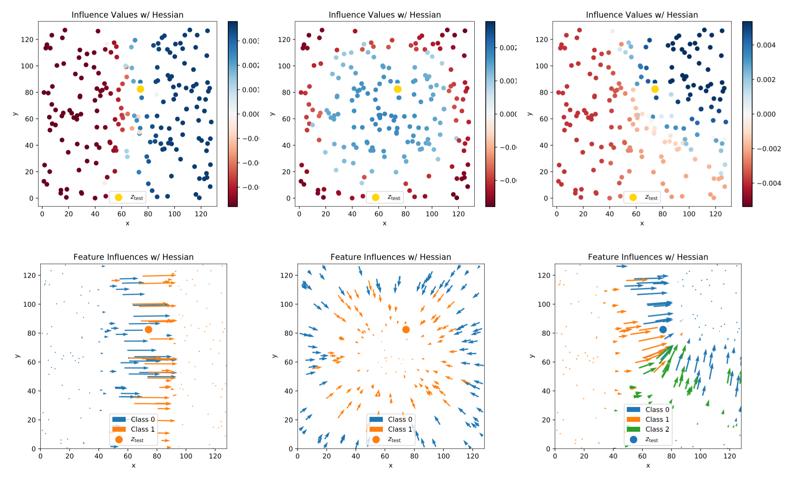

# Interpreting Sum-Product Networks via Influence Functions
#### [Mark Rothermel](https://github.com/MaggiR), Computer Science Bachelor Thesis, Aug 2019, TU Darmstadt.

> The implementation mainly uses the [SPFlow](https://github.com/SPFlow/SPFlow) library,
>Tensorflow, and snippets from the repository
[influence-release](https://github.com/kohpangwei/influence-release).

## Quick intro
**Sum-Product Networks (SPNs)** ([Poon et al., 2012](https://arxiv.org/abs/1202.3732)) are graphical models
used in Deep Machine Learning for probabilistic modeling. SPNs lack explainability.
**Influence Functions (IFs)** ([Koh et al., 2017](http://proceedings.mlr.press/v70/koh17a/koh17a.pdf)) 
are a mathematical concept which can be used to investigate the effect of a training
example on the model's parameters and, in turn, the model's performance on a reference (test) example, revealing
the local learning behavior of the model, which is helpful for understanding the model and the reasons for its predictions.

## Some exemplary influence plots

## Tutorial
For a full tutorial, see .

## Thesis
For the full-text bachelor thesis see .
